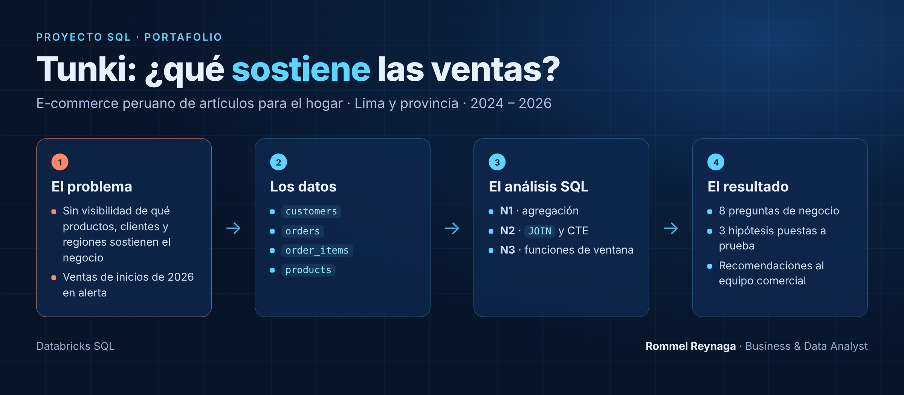
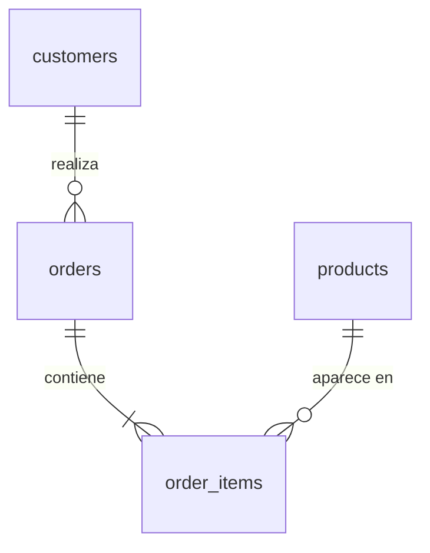

# Proyecto SQL: Análisis de Ventas del E-commerce Tunki - Ventas, ticket promedio y margen


## Resumen (Overview)
_**Tunki** es un e-commerce peruano de artículos para el hogar —desde decoración, menaje, textiles, organización e iluminación hasta muebles y pequeños electrodomésticos de cocina— que vende en Lima y en provincia. Su equipo comercial enfrenta dos problemas:_

- **No tiene una visión clara de qué productos, clientes y regiones sostienen el negocio.**
- **Las ventas de inicios de 2026 encendieron las alertas.**

_Mi objetivo es utilizar **SQL** dentro de **Databricks** para analizar sus datos de ventas, encontrar qué impulsa y qué frena el negocio, y entregar recomendaciones que ayuden al equipo comercial a tomar mejores decisiones._



## 📩 Si quieres aprender SQL Conéctate conmigo
<p align="center">
  <a href="https://www.linkedin.com/in/rommel-aar%C3%B3n-reynaga-alvarado-470299222/">
    
  </a>
</p>

## Estructura del Proyecto

- [Sobre los Datos](#sobre-los-datos)
- [Tareas](#tareas)
- [Limpieza de Datos](#limpieza-de-datos)
- [Análisis Exploratorio de Datos (EDA) e Insights](#análisis-exploratorio-de-datos-eda-e-insights)
- [Conclusión](#conclusión)

## Sobre los Datos

Son cuatro tablas que registran los clientes, los pedidos, el detalle de cada pedido y el catálogo de productos de Tunki. Los datos están en la carpeta [`/Data`](./Data). 



## Tareas

En este análisis ayudo al equipo comercial a responder lo siguiente:
 
1. **Ventas en el tiempo:** ¿Cómo evolucionan las ventas, los pedidos y el ticket promedio cada mes?
2. **Crecimiento interanual:** ¿Cómo varían las ventas contra el mismo mes del año anterior y qué mes rompe la tendencia?
3. **Categorías:** ¿Qué categorías venden más y cuáles dejan más margen?
4. **Productos top:** ¿Cuáles son los 3 productos más vendidos de cada categoría?
5. **Clientes:** ¿Cuánto venden los clientes nuevos frente a los recurrentes, y de qué canal llegan?
6. **Pedidos perdidos:** ¿Qué porcentaje de pedidos se cancela o se devuelve?
7. **Regiones:** ¿Cómo se comparan Lima y provincia en ventas, ticket y costo de envío?
8. **Rentabilidad por pedido:** ¿Qué rangos de monto de pedido dejan más margen después del envío?


## Limpieza de Datos

Revisé las cuatro tablas con cinco controles de calidad primeramente detectando valores nulos, duplicados, textos inconsistentes, ranfo de fechas y la consistencia entre las tablas, como se muestra en la siguiente tabla. El código completo está en [`Scripts/02_limpieza.sql`](./Scripts/02_limpieza.sql).
 
| # | Control | Tabla | Hallazgo | Acción |
|---|---|---|---|---|
| 1 | Valores nulos | `customers` | 435 clientes sin `city` | Se marcan como "Sin dato" |
| 2 | Duplicados | `orders` | 197 pedidos registrados dos veces | Se eliminan → `orders_clean` |
| 3 | Texto inconsistente | `customers` | `shipping_region` escrito de 10 formas para 2 regiones | Se estandariza → `customers_clean` |
| 4 | Rango de fechas | `orders` | Datos del 01-01-2024 al 12-02-2026; febrero 2026 solo tiene 12 días | Regla: excluir feb-2026 de comparaciones mensuales |
| 5 | Consistencia entre tablas | `order_items`, `products` | En jul-2025 se actualizó la lista (precios +4 %, costos +3 %); el catálogo solo guarda la lista vigente, por eso las ventas anteriores no coinciden con él. Además, 400 productos comparten 208 nombres | Regla: calcular desde `order_items`; agrupar por `product_id` |

#### 1. Detección

**1.1 Valores nulos (`customers`)**
```sql
SELECT 
  COUNT(*) AS filas, 
  count_if(city IS NULL) AS nulos_city
FROM customers;
-- 435 clientes sin ciudad
```
 
**1.2 Pedidos duplicados (`orders`)**
```sql
SELECT 
  COUNT(*) AS filas_totales, 
  COUNT(DISTINCT order_id) AS pedidos_unicos
FROM orders;
-- 39.528 filas vs 39.331 pedidos → 197 duplicados
```
 
**1.3 Texto inconsistente (`customers.shipping_region`)**
```sql
SELECT 
  DISTINCT shipping_region 
FROM customers 
ORDER BY shipping_region;
```


**1.4 Rango de fechas (`orders`)**
```sql
SELECT 
  DATE(MIN(order_datetime)) AS primer_pedido,
  DATE(MAX(order_datetime)) AS ultimo_pedido
FROM orders;
 
SELECT 
  date_format(order_datetime, 'yyyy-MM') AS mes,
  COUNT(DISTINCT DATE(order_datetime))   AS dias_con_pedidos
FROM orders
GROUP BY 1 
ORDER BY 1;
-- Febrero 2026: solo 12 días con pedidos
```
 
**1.5 Consistencia entre tablas**
```sql
-- a) ¿El monto del pedido cuadra con la suma de sus líneas? → 0 diferencias
WITH monto_por_pedido AS (
  SELECT 
      order_id, 
      SUM(quantity * unit_price) AS total_lineas
  FROM order_items 
  GROUP BY order_id
)
SELECT 
  count_if(ABS(o.merchandise_value - mp.total_lineas) > 0.01) AS pedidos_que_no_cuadran
FROM orders o
JOIN monto_por_pedido mp ON mp.order_id = o.order_id;
 
-- b) ¿El precio de cada venta coincide con el catálogo? → 49.674 de 74.821 no coinciden
SELECT 
  count_if(oi.unit_price <> p.unit_price) AS precio_distinto,
  count_if(oi.unit_cost  <> p.unit_cost)  AS costo_distinto,
  COUNT(*)                                AS lineas
FROM order_items oi
JOIN products p ON p.product_id = oi.product_id;
 
-- b2) ¿Desde cuándo coinciden? → hasta jun-2025 ninguna; desde jul-2025 todas
SELECT 
  date_format(o.order_datetime, 'yyyy-MM') AS mes,
  count_if(oi.unit_price <> p.unit_price)  AS lineas_precio_distinto,
  COUNT(*)                                 AS lineas
FROM order_items oi
JOIN products p     ON p.product_id = oi.product_id
JOIN orders_clean o ON o.order_id   = oi.order_id
GROUP BY 1 
ORDER BY 1;

-- b3) ¿Cuánto cambió la lista? → precios +4 %, costos +3 %
SELECT 
  ROUND(AVG(p.unit_price / oi.unit_price - 1) * 100, 2) AS cambio_precio_pct,
  ROUND(AVG(p.unit_cost  / oi.unit_cost  - 1) * 100, 2) AS cambio_costo_pct
FROM order_items oi
JOIN products p     ON p.product_id = oi.product_id
JOIN orders_clean o ON o.order_id   = oi.order_id
WHERE o.order_datetime < '2025-07-01';
 
-- c) ¿El nombre identifica al producto? → 400 productos, 208 nombres
SELECT 
  COUNT(*) AS productos, 
  COUNT(DISTINCT product_name) AS nombres_unicos
FROM products;
```

#### 2. Limpieza

```sql
-- Pedidos sin duplicados
CREATE OR REPLACE TABLE orders_clean AS
SELECT 
  DISTINCT *
FROM orders;

-- Clientes con región estandarizada y ciudad sin nulos
CREATE OR REPLACE TABLE customers_clean AS
SELECT
  customer_id,
  signup_date,
  LOWER(TRIM(shipping_region))  AS shipping_region,
  COALESCE(city, 'Sin dato')    AS city,
  acquisition_channel
FROM customers;
```

#### 3. Verificación

```sql
-- 39.331 filas = 39.331 pedidos únicos
SELECT 
  COUNT(*) AS filas, 
  COUNT(DISTINCT order_id) AS pedidos_unicos
FROM orders_clean;

-- 2 regiones; 12.699 + 9.783 = 22.482 clientes, el mismo total de la tabla original
SELECT 
  shipping_region, 
  COUNT(*) AS clientes
FROM customers_clean
GROUP BY shipping_region;
```


#### 4. Reglas para el análisis
 
- El análisis usa `orders_clean` y `customers_clean`; `order_items` y `products` se usan tal cual.
- Ventas y costos se calculan desde `order_items` u `orders`, nunca desde el catálogo.
- Los productos se agrupan por `product_id`, no por nombre.
- Febrero 2026 está incompleto: se excluye de las comparaciones mensuales.
- En jul-2025 cambió la lista de precios: al comparar crecimiento entre años, se separa el efecto de precio del efecto de volumen (pedidos y unidades).
- Los montos se redondean solo en el resultado final (`ROUND(SUM(...), 2)`), nunca antes de sumar.

## Análisis Exploratorio de Datos (EDA) e Insights

**Definición de venta usada en todo el análisis:** pedidos con estado `COMPLETED`, medidos con `merchandise_value` (valor de los productos, sin envío). Los pedidos cancelados y devueltos se analizan aparte en la pregunta 6. Febrero 2026 se excluye por estar incompleto. Todas las queries están en [`Scripts/03_analisis.sql`](./Scripts/03_analisis.sql).

### Pregunta 1: ¿Cómo evolucionan las ventas, los pedidos y el ticket promedio cada mes?
 
**Análisis:** agrupé los pedidos completados por mes con `DATE_FORMAT` y calculé las ventas con `SUM`, los pedidos con `COUNT` y el ticket promedio como ventas entre pedidos.
 
Las ventas son **estacionales**: suben en mayo (coincide con el Día de la Madre), alcanzan su pico en noviembre y diciembre, y caen a su punto más bajo en enero. El patrón se repite en 2024 y en 2025. Además hay una **tendencia de crecimiento**: 2025 vendió **19,2 % más** que 2024, impulsado sobre todo por más pedidos (+17,1 %) y en menor medida por un ticket más alto (+1,8 %).
 
```sql
SELECT
    DATE_FORMAT(order_datetime, 'yyyy-MM')              AS fecha,
    COUNT(order_id)                                     AS pedidos,
    ROUND(SUM(merchandise_value), 2)                    AS ventas,
    ROUND(SUM(merchandise_value) / COUNT(order_id), 2)  AS ticket_promedio
FROM orders_clean
WHERE order_status = 'COMPLETED'
  AND order_datetime < '2026-02-01'
GROUP BY fecha
ORDER BY fecha;
```


_Ventas mensuales de pedidos completados (ene-2024 a ene-2026)_

### Pregunta 2: ¿Cómo varían las ventas contra el mismo mes del año anterior y qué mes rompe la tendencia?
 
**Análisis:** comparar enero contra diciembre mezcla la estacionalidad con el desempeño real, porque enero siempre cae después de las fiestas. Por eso comparé cada mes con **el mismo mes del año anterior**: con `LAG` y `PARTITION BY MONTH(mes)`, enero se compara solo con enero y la estacionalidad queda neutralizada. Usé dos CTE: la primera arma las ventas por mes y la segunda trae el valor del año anterior.
 
**Lo que se creía:** que la caída de enero 2026 era estacional, "como todos los eneros".
 
**Lo que mostró la data:**
- Durante **12 meses seguidos** (ene-2025 a dic-2025) las ventas crecieron entre **9,3 % y 25 %** frente al mismo mes del año anterior. En enero 2025, por ejemplo, crecieron 15 % gracias a más pedidos (+18,9 %).
- En **enero 2026 la tendencia se rompe:** las ventas caen **9,4 % (−14,5 mil soles)** frente a enero 2025. El mes está completo (31 días con pedidos), así que no es un error de corte.
- La caída viene de **los pedidos, no del ticket:** hubo 134 pedidos menos (−13,2 %), lo que restó **≈ 20,3 mil soles**. El ticket subió 4,4 % y recuperó **≈ 5,9 mil soles**.
- La caída después de las fiestas fue más profunda que el año anterior: de diciembre a enero las ventas bajaron **−64,9 %** en 2026, contra **−51,6 %** en 2025.
**Conclusión:** la estacionalidad existe, pero **no explica** la caída de enero 2026. Algo cambió ese mes y afectó la cantidad de pedidos. Las siguientes preguntas buscan dónde.
 
```sql
WITH ventas_mes AS (
    SELECT
        DATE_TRUNC('MONTH', order_datetime) AS mes,
        COUNT(order_id)                     AS pedidos,
        SUM(merchandise_value)              AS ventas
    FROM orders_clean
    WHERE order_status = 'COMPLETED' AND order_datetime < '2026-02-01'
    GROUP BY DATE_TRUNC('MONTH', order_datetime)
),
mismo_mes_anio_anterior AS (
    SELECT
        mes, pedidos, ventas,
        LAG(ventas)  OVER (PARTITION BY MONTH(mes) ORDER BY YEAR(mes)) AS ventas_aa,
        LAG(pedidos) OVER (PARTITION BY MONTH(mes) ORDER BY YEAR(mes)) AS pedidos_aa
    FROM ventas_mes
)
SELECT
    DATE_FORMAT(mes, 'yyyy-MM')                                         AS fecha,
    ROUND(ventas, 2)                                                    AS ventas,
    ROUND(ventas - ventas_aa, 2)                                        AS diferencia_ventas,
    ROUND((ventas - ventas_aa) / ventas_aa * 100, 1)                    AS crec_ventas_pct,
    ROUND((pedidos - pedidos_aa) / pedidos_aa * 100, 1)                 AS crec_pedidos_pct,
    ROUND(((ventas / pedidos) / (ventas_aa / pedidos_aa) - 1) * 100, 1) AS crec_ticket_pct,
    CASE WHEN ventas > ventas_aa THEN 'Crece' ELSE 'Cae' END            AS tendencia
FROM mismo_mes_anio_anterior
WHERE ventas_aa IS NOT NULL
ORDER BY mes;
```


 
_Variación de cada mes frente al mismo mes del año anterior_


## Conclusion

