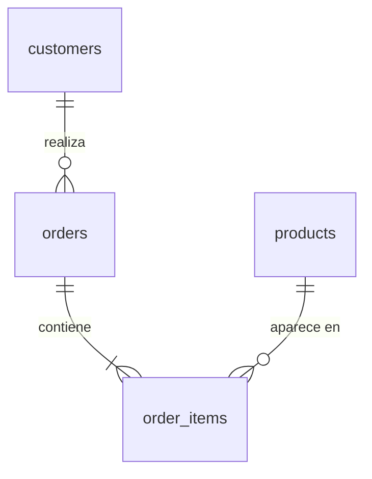

# Proyecto SQL: Análisis de Ventas del E-commerce Tunki - Ventas, ticket promedio y margen


## Resumen (Overview)
_**Tunki** es un e-commerce peruano de artículos para el hogar —desde decoración, menaje, textiles, organización e iluminación hasta muebles y pequeños electrodomésticos de cocina— que vende en Lima y en provincia. Su equipo comercial enfrenta dos problemas:_

- **No tiene una visión clara de qué productos, clientes y regiones sostienen el negocio.**
- **Las ventas de inicios de 2026 encendieron las alertas.**

_Mi objetivo es utilizar **SQL** dentro de **Databricks** para analizar sus datos de ventas, encontrar qué impulsa y qué frena el negocio, y entregar recomendaciones que ayuden al equipo comercial a tomar mejores decisiones._


## 📩 Si quieres aprender SQL Conéctate conmigo
<p align="center">
  <a href="https://www.linkedin.com/in/rommel-aar%C3%B3n-reynaga-alvarado-470299222/">
    
  </a>
</p>

## Estructura del Proyecto

- [Sobre los Datos](#sobre-los-datos)
- [Tareas](#tareas)
- [Limpieza de Datos](#limpieza-de-datos)
- [Análisis Exploratorio de Datos (EDA) e Insights](#análisis-exploratorio-de-datos-eda-e-insights)
- [Conclusión](#conclusión)

## Sobre los Datos

Son cuatro tablas que registran los clientes, los pedidos, el detalle de cada pedido y el catálogo de productos de Tunki. Los datos están en la carpeta [`/Data`](./Data). 



## Tareas

**Hipótesis de partida:**
- **H1 · Estacionalidad:** las ventas suben hacia fin de año y caen a inicios de año.
- **H2 · Concentración:** pocas categorías concentran la mayor parte de las ventas, pero no necesariamente del margen.
- **H3 · Recurrencia:** los clientes que vuelven a comprar gastan más que los clientes nuevos.

En este análisis ayudo al equipo comercial a responder lo siguiente:

1. **Ventas en el tiempo:** ¿Cómo evolucionan las ventas, los pedidos y el ticket promedio cada mes?
2. **Categorías:** ¿Qué categorías venden más y cuáles dejan más margen?
3. **Pedidos perdidos:** ¿Qué porcentaje de pedidos se cancela o se devuelve?
4. **Regiones:** ¿Cómo se comparan Lima y provincia en ventas, ticket y costo de envío?
5. **Clientes:** ¿Cuánto venden los clientes nuevos frente a los recurrentes, y de qué canal llegan?
6. **Rentabilidad por pedido:** ¿Qué rangos de monto de pedido dejan más margen después del envío?
7. **Productos top:** ¿Cuáles son los 3 productos más vendidos de cada categoría?
8. **Crecimiento:** ¿Cómo varían las ventas mes a mes y año contra año, y qué mes tuvo la peor caída?


## Limpieza de Datos

Revisé las cuatro tablas con cinco controles de calidad. Primero detecté los problemas, después corregí los que lo requerían creando tablas limpias (sin modificar las originales) y, por último, definí reglas para los hallazgos que no se corrigen pero cambian cómo se calcula. El código completo está en [`Scripts/02_limpieza.sql`](./Scripts/02_limpieza.sql).
 
| # | Control | Tabla | Hallazgo | Acción |
|---|---|---|---|---|
| 1 | Valores nulos | `customers` | 435 clientes sin `city` | Se marcan como "Sin dato" |
| 2 | Duplicados | `orders` | 197 pedidos registrados dos veces | Se eliminan → `orders_clean` |
| 3 | Texto inconsistente | `customers` | `shipping_region` escrito de 10 formas para 2 regiones | Se estandariza → `customers_clean` |
| 4 | Rango de fechas | `orders` | Datos del 01-01-2024 al 12-02-2026; febrero 2026 solo tiene 12 días | Regla: excluir feb-2026 de comparaciones mensuales |
| 5 | Consistencia entre tablas | `order_items`, `products` | En jul-2025 se actualizó la lista (precios +4 %, costos +3 %); el catálogo solo guarda la lista vigente, por eso las ventas anteriores no coinciden con él. Además, 400 productos comparten 208 nombres | Regla: calcular desde `order_items`; agrupar por `product_id` |

#### 1. Detección

**1.1 Valores nulos (`customers`)**
```sql
SELECT 
  COUNT(*) AS filas, 
  count_if(city IS NULL) AS nulos_city
FROM customers;
-- 435 clientes sin ciudad
```
 
**1.2 Pedidos duplicados (`orders`)**
```sql
SELECT 
  COUNT(*) AS filas_totales, 
  COUNT(DISTINCT order_id) AS pedidos_unicos
FROM orders;
-- 39.528 filas vs 39.331 pedidos → 197 duplicados
```
 
**1.3 Texto inconsistente (`customers.shipping_region`)**
```sql
SELECT 
  DISTINCT shipping_region 
FROM customers 
ORDER BY shipping_region;
```


**1.4 Rango de fechas (`orders`)**
```sql
SELECT 
  DATE(MIN(order_datetime)) AS primer_pedido,
  DATE(MAX(order_datetime)) AS ultimo_pedido
FROM orders;
 
SELECT 
  date_format(order_datetime, 'yyyy-MM') AS mes,
  COUNT(DISTINCT DATE(order_datetime))   AS dias_con_pedidos
FROM orders
GROUP BY 1 
ORDER BY 1;
-- Febrero 2026: solo 12 días con pedidos
```
 
**1.5 Consistencia entre tablas**
```sql
-- a) ¿El monto del pedido cuadra con la suma de sus líneas? → 0 diferencias
WITH monto_por_pedido AS (
  SELECT 
      order_id, 
      SUM(quantity * unit_price) AS total_lineas
  FROM order_items 
  GROUP BY order_id
)
SELECT 
  count_if(ABS(o.merchandise_value - mp.total_lineas) > 0.01) AS pedidos_que_no_cuadran
FROM orders o
JOIN monto_por_pedido mp ON mp.order_id = o.order_id;
 
-- b) ¿El precio de cada venta coincide con el catálogo? → 49.674 de 74.821 no coinciden
SELECT 
  count_if(oi.unit_price <> p.unit_price) AS precio_distinto,
  count_if(oi.unit_cost  <> p.unit_cost)  AS costo_distinto,
  COUNT(*)                                AS lineas
FROM order_items oi
JOIN products p ON p.product_id = oi.product_id;
 
-- b2) ¿Desde cuándo coinciden? → hasta jun-2025 ninguna; desde jul-2025 todas
SELECT 
  date_format(o.order_datetime, 'yyyy-MM') AS mes,
  count_if(oi.unit_price <> p.unit_price)  AS lineas_precio_distinto,
  COUNT(*)                                 AS lineas
FROM order_items oi
JOIN products p     ON p.product_id = oi.product_id
JOIN orders_clean o ON o.order_id   = oi.order_id
GROUP BY 1 
ORDER BY 1;

-- b3) ¿Cuánto cambió la lista? → precios +4 %, costos +3 %
SELECT 
  ROUND(AVG(p.unit_price / oi.unit_price - 1) * 100, 2) AS cambio_precio_pct,
  ROUND(AVG(p.unit_cost  / oi.unit_cost  - 1) * 100, 2) AS cambio_costo_pct
FROM order_items oi
JOIN products p     ON p.product_id = oi.product_id
JOIN orders_clean o ON o.order_id   = oi.order_id
WHERE o.order_datetime < '2025-07-01';
 
-- c) ¿El nombre identifica al producto? → 400 productos, 208 nombres
SELECT 
  COUNT(*) AS productos, 
  COUNT(DISTINCT product_name) AS nombres_unicos
FROM products;
```

#### 2. Limpieza

```sql
-- Pedidos sin duplicados
CREATE OR REPLACE TABLE orders_clean AS
SELECT 
  DISTINCT *
FROM orders;

-- Clientes con región estandarizada y ciudad sin nulos
CREATE OR REPLACE TABLE customers_clean AS
SELECT
  customer_id,
  signup_date,
  LOWER(TRIM(shipping_region))  AS shipping_region,
  COALESCE(city, 'Sin dato')    AS city,
  acquisition_channel
FROM customers;
```

#### 3. Verificación

```sql
-- 39.331 filas = 39.331 pedidos únicos
SELECT 
  COUNT(*) AS filas, 
  COUNT(DISTINCT order_id) AS pedidos_unicos
FROM orders_clean;

-- 2 regiones; 12.699 + 9.783 = 22.482 clientes, el mismo total de la tabla original
SELECT 
  shipping_region, 
  COUNT(*) AS clientes
FROM customers_clean
GROUP BY shipping_region;
```


## Análisis Exploratorio de Datos (EDA) e Insights


## Conclusion

