# Proyecto SQL: Análisis de Ventas del E-commerce Tunki - Ventas, ticket promedio y margen


## Resumen (Overview)

_**Tunki** es un e-commerce peruano de artículos para el hogar —desde decoración, menaje, textiles, organización e iluminación hasta muebles y pequeños electrodomésticos de cocina— que vende en Lima y en provincia. Su equipo comercial enfrenta dos problemas:_
 
- **No tiene una visión clara de qué productos, clientes y regiones sostienen el negocio.**
- **Las ventas de inicios de 2026 encendieron las alertas.**
_Mi objetivo es utilizar **SQL** dentro de **Databricks** para analizar sus datos de ventas, encontrar qué impulsa y qué frena el negocio, y entregar recomendaciones que ayuden al equipo comercial a tomar mejores decisiones._
 
**Resultado:** la caída de inicios de 2026 no fue estacional. Se concentró en provincia (−56 % de pedidos en enero), justo después de que Tunki subiera la tarifa y el umbral de envío gratis para esa región.


## 📩 Conéctate conmigo
<p align="center">
  <a href="https://www.linkedin.com/in/rommel-aar%C3%B3n-reynaga-alvarado-470299222/">
    
  </a>
</p>

## Estructura del Proyecto
 
- [Sobre los Datos](#sobre-los-datos)
- [Tareas](#tareas)
- [Limpieza de Datos](#limpieza-de-datos)
- [Análisis Exploratorio de Datos (EDA) e Insights](#análisis-exploratorio-de-datos-eda-e-insights)
- [Conclusión](#conclusión)

## Sobre los Datos
 
Son cuatro tablas que registran los clientes, los pedidos, el detalle de cada pedido y el catálogo de productos de Tunki. Los CSV se cargaron en Databricks con su asistente de carga de archivos; la estructura resultante está en [`Scripts/01_DDL.sql`](./Scripts/01_DDL.sql).
 
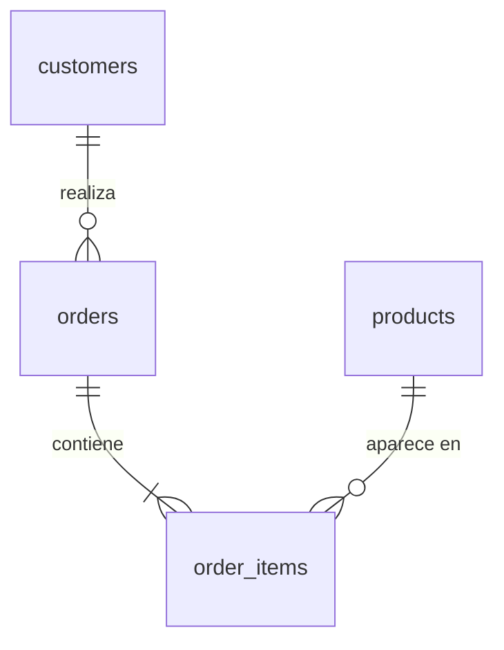

## Tareas

En este análisis ayudo al equipo comercial a responder lo siguiente:
 
1. **Ventas en el tiempo:** ¿Cómo evolucionan las ventas, los pedidos y el ticket promedio cada mes?
2. **Pedidos perdidos:** ¿Qué porcentaje de pedidos se cancela o se devuelve cada año?
3. **Categorías:** ¿Qué categorías venden más y cuáles dejan más margen?
4. **Productos top:** ¿Cuáles son los 3 productos más vendidos de cada categoría?
5. **Regiones:** ¿Cómo se comparan Lima y provincia en ventas, ticket y costo de envío?
6. **Crecimiento:** ¿Cómo crecen las ventas frente al mismo mes del año anterior?
7. **Caída de enero:** ¿En qué región y en qué tipo de pedido cayó enero 2026?
8. **Envío:** ¿Qué cambió en el envío a provincia en enero 2026?

## Limpieza de Datos

Revisé las cuatro tablas con cinco controles de calidad: valores nulos, duplicados, textos inconsistentes, rango de fechas y consistencia entre tablas. La siguiente tabla resume qué encontré en cada control y qué hice al respecto. El código completo está en [`Scripts/02_limpieza.sql`](./Scripts/02_limpieza.sql).
 
| # | Control | Tabla | Hallazgo | Acción |
|---|---|---|---|---|
| 1 | Valores nulos | `customers` | 435 clientes sin `city` | Se marcan como "Sin dato" |
| 2 | Duplicados | `orders` | 197 pedidos registrados dos veces | Se eliminan → `orders_clean` |
| 3 | Texto inconsistente | `customers` | `shipping_region` escrito de 10 formas para 2 regiones | Se estandariza → `customers_clean` |
| 4 | Rango de fechas | `orders` | Datos del 01-01-2024 al 12-02-2026; febrero 2026 solo tiene 12 días | Regla: excluir feb-2026 de comparaciones mensuales |
| 5 | Consistencia entre tablas | `order_items`, `products` | En jul-2025 se actualizó la lista (precios +4 %, costos +3 %); el catálogo solo guarda la lista vigente, por eso las ventas anteriores no coinciden con él. Además, 400 productos comparten 208 nombres | Regla: calcular desde `order_items`; agrupar por `product_id` |

#### 1. Detección

**1.1 Valores nulos (`customers`)**
```sql
SELECT 
  COUNT(*) AS filas, 
  count_if(city IS NULL) AS nulos_city
FROM customers;
-- 435 clientes sin ciudad
```
 
**1.2 Pedidos duplicados (`orders`)**
```sql
SELECT 
  COUNT(*) AS filas_totales, 
  COUNT(DISTINCT order_id) AS pedidos_unicos
FROM orders;
-- 39.528 filas vs 39.331 pedidos → 197 duplicados
```
 
**1.3 Texto inconsistente (`customers.shipping_region`)**
```sql
SELECT 
  DISTINCT shipping_region 
FROM customers 
ORDER BY shipping_region;
```
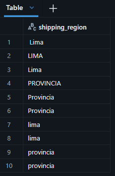


**1.4 Rango de fechas (`orders`)**
```sql
SELECT 
  DATE(MIN(order_datetime)) AS primer_pedido,
  DATE(MAX(order_datetime)) AS ultimo_pedido
FROM orders;
 
SELECT 
  date_format(order_datetime, 'yyyy-MM') AS mes,
  COUNT(DISTINCT DATE(order_datetime))   AS dias_con_pedidos
FROM orders
GROUP BY 1 
ORDER BY 1;
-- Febrero 2026: solo 12 días con pedidos
```
 
**1.5 Consistencia entre tablas**
```sql
-- a) ¿El monto del pedido cuadra con la suma de sus líneas? → 0 diferencias
WITH monto_por_pedido AS (
  SELECT 
      order_id, 
      SUM(quantity * unit_price) AS total_lineas
  FROM order_items 
  GROUP BY order_id
)
SELECT 
  count_if(ABS(o.merchandise_value - mp.total_lineas) > 0.01) AS pedidos_que_no_cuadran
FROM orders o
JOIN monto_por_pedido mp ON mp.order_id = o.order_id;
 
-- b) ¿El precio de cada venta coincide con el catálogo? → 49.674 de 74.821 no coinciden
SELECT 
  count_if(oi.unit_price <> p.unit_price) AS precio_distinto,
  count_if(oi.unit_cost  <> p.unit_cost)  AS costo_distinto,
  COUNT(*)                                AS lineas
FROM order_items oi
JOIN products p ON p.product_id = oi.product_id;
 
-- b2) ¿Desde cuándo coinciden? → hasta jun-2025 ninguna; desde jul-2025 todas
SELECT 
  date_format(o.order_datetime, 'yyyy-MM') AS mes,
  count_if(oi.unit_price <> p.unit_price)  AS lineas_precio_distinto,
  COUNT(*)                                 AS lineas
FROM order_items oi
JOIN products p     ON p.product_id = oi.product_id
JOIN orders_clean o ON o.order_id   = oi.order_id
GROUP BY 1 
ORDER BY 1;

-- b3) ¿Cuánto cambió la lista? → precios +4 %, costos +3 %
SELECT 
  ROUND(AVG(p.unit_price / oi.unit_price - 1) * 100, 2) AS cambio_precio_pct,
  ROUND(AVG(p.unit_cost  / oi.unit_cost  - 1) * 100, 2) AS cambio_costo_pct
FROM order_items oi
JOIN products p     ON p.product_id = oi.product_id
JOIN orders_clean o ON o.order_id   = oi.order_id
WHERE o.order_datetime < '2025-07-01';
 
-- c) ¿El nombre identifica al producto? → 400 productos, 208 nombres
SELECT 
  COUNT(*) AS productos, 
  COUNT(DISTINCT product_name) AS nombres_unicos
FROM products;
```

#### 2. Limpieza

```sql
-- Pedidos sin duplicados
CREATE OR REPLACE TABLE orders_clean AS
SELECT 
  DISTINCT *
FROM orders;

-- Clientes con región estandarizada y ciudad sin nulos
CREATE OR REPLACE TABLE customers_clean AS
SELECT
  customer_id,
  signup_date,
  LOWER(TRIM(shipping_region))  AS shipping_region,
  COALESCE(city, 'Sin dato')    AS city,
  acquisition_channel
FROM customers;
```

#### 3. Verificación

```sql
-- 39.331 filas = 39.331 pedidos únicos
SELECT 
  COUNT(*) AS filas, 
  COUNT(DISTINCT order_id) AS pedidos_unicos
FROM orders_clean;

-- 2 regiones; 12.699 + 9.783 = 22.482 clientes, el mismo total de la tabla original
SELECT 
  shipping_region, 
  COUNT(*) AS clientes
FROM customers_clean
GROUP BY shipping_region;
```
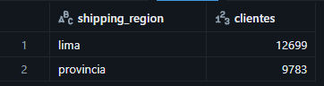

#### 4. Reglas para el análisis
 
- El análisis usa `orders_clean` y `customers_clean`; `order_items` y `products` se usan tal cual.
- Ventas y costos se calculan desde `order_items` u `orders_clean`, nunca desde el catálogo.
- Los productos se agrupan por `product_id`, no por nombre.
- Febrero 2026 está incompleto: se excluye de las comparaciones mensuales.
- En jul-2025 cambió la lista de precios: al comparar crecimiento entre años, se separa el efecto de precio del efecto de volumen (pedidos y unidades).
- Los montos se redondean solo en el resultado final (`ROUND(SUM(...), 2)`), nunca antes de sumar.

## Análisis Exploratorio de Datos (EDA) e Insights

**Definición de venta usada en todo el análisis:** pedidos con estado `COMPLETED`, medidos con `merchandise_value` (valor de los productos, sin envío). Febrero 2026 se excluye por estar incompleto. Todas las queries están en [`Scripts/03_analisis.sql`](./Scripts/03_analisis.sql).

### Pregunta 1: ¿Cómo evolucionan las ventas, los pedidos y el ticket promedio cada mes?
 
Respondí en dos pasos: primero la evolución mes a mes, para ver el patrón; después el total por año, para medir cuánto creció el negocio.
 
**Paso 1 · Ventas por mes.** Agrupé los pedidos completados por mes y calculé las ventas, los pedidos y el ticket promedio (ventas entre pedidos). Las ventas son **estacionales**: en los dos años suben en mayo (coincide con el Día de la Madre), llegan a su pico en diciembre y caen a su punto más bajo en enero. El ticket se mantiene estable, entre 147 y 161 soles, así que **lo que mueve las ventas es la cantidad de pedidos**. La señal de alerta: **enero 2026 (140,1 mil) vendió menos que enero 2025 (154,6 mil)**, cuando todos los meses de 2025 habían superado al mismo mes de 2024.
 
```sql
SELECT
    DATE_FORMAT(order_datetime, 'yyyy-MM')              AS fecha,
    COUNT(order_id)                                     AS pedidos,
    ROUND(SUM(merchandise_value), 2)                    AS ventas,
    ROUND(SUM(merchandise_value) / COUNT(order_id), 2)  AS ticket_promedio
FROM orders_clean
WHERE order_status = 'COMPLETED'
  AND order_datetime < '2026-02-01'
GROUP BY fecha
ORDER BY fecha;
```

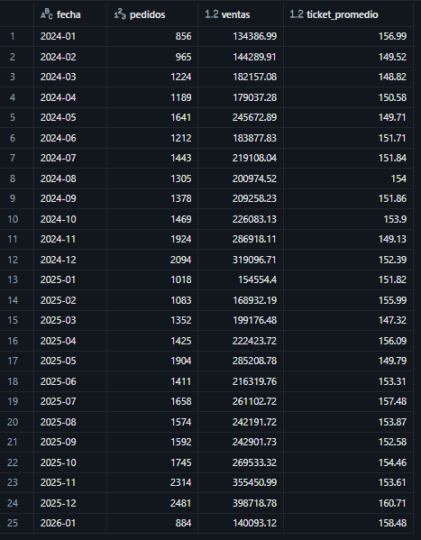

_Ventas mensuales de pedidos completados (ene-2024 a ene-2026)_

**Paso 2 · Crecimiento anual.** Puse 2024 y 2025 en una sola fila con agregación condicional (`count_if` y `SUM(CASE WHEN ...)`) y calculé el crecimiento de las ventas, de los pedidos y del ticket.
 
2025 vendió **19,2 % más** que 2024 (3,02 M vs 2,53 M de soles). Como **ventas = pedidos × ticket**, el crecimiento de las ventas es la multiplicación de los otros dos:
 
> (1 + 17,1 % pedidos) × (1 + 1,8 % ticket) = 1,171 × 1,018 = **1,192 → +19,2 % en ventas**
 
Casi todo el crecimiento vino de **vender más pedidos**, no de un ticket más alto.
 
```sql
WITH anual AS (
    SELECT
        count_if(YEAR(order_datetime) = 2024)                                 AS pedidos_2024,
        count_if(YEAR(order_datetime) = 2025)                                 AS pedidos_2025,
        SUM(CASE WHEN YEAR(order_datetime) = 2024 THEN merchandise_value END) AS ventas_2024,
        SUM(CASE WHEN YEAR(order_datetime) = 2025 THEN merchandise_value END) AS ventas_2025
    FROM orders_clean
    WHERE order_status = 'COMPLETED'
)
SELECT
    ROUND(ventas_2024, 2)                                                       AS ventas_2024,
    ROUND(ventas_2025, 2)                                                       AS ventas_2025,
    ROUND((ventas_2025 / ventas_2024 - 1) * 100, 1)                             AS crec_ventas_pct,
    ROUND((pedidos_2025 / pedidos_2024 - 1) * 100, 1)                           AS crec_pedidos_pct,
    ROUND(((ventas_2025 / pedidos_2025) / (ventas_2024 / pedidos_2024) - 1) * 100, 1) AS crec_ticket_pct
FROM anual;
```
 
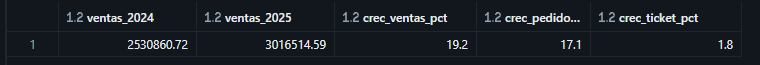
 
_Crecimiento de ventas, pedidos y ticket: 2025 vs 2024_

### Pregunta 2: ¿Qué porcentaje de pedidos se cancela o se devuelve cada año?
 
Conté por año los pedidos cancelados y devueltos con `count_if`, calculé su porcentaje sobre el total y sumé el valor de los pedidos que no se concretaron.
 
Cada año se pierde **≈ 4,5 % de los pedidos** (≈ 3 % cancelados y 1,6 % devueltos), equivalente a **263 mil soles** entre 2024 y 2025. La tasa es estable, y en enero 2026 no subió. **Las cancelaciones no explican la caída de enero.**

```sql
SELECT
    YEAR(order_datetime)                                                AS anio,
    COUNT(*)                                                            AS pedidos,
    ROUND(count_if(order_status = 'CANCELLED') * 100.0 / COUNT(*), 1)   AS pct_cancelados,
    ROUND(count_if(order_status = 'RETURNED')  * 100.0 / COUNT(*), 1)   AS pct_devueltos,
    ROUND(SUM(CASE WHEN order_status <> 'COMPLETED'
                   THEN merchandise_value ELSE 0 END), 2)               AS ventas_perdidas
FROM orders_clean
WHERE order_datetime < '2026-02-01'
GROUP BY anio
ORDER BY anio;
-- La fila 2026 corresponde solo a enero
```

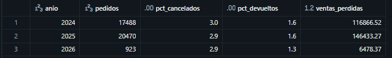
 
_Pedidos cancelados y devueltos por año_

### Pregunta 3: ¿Qué categorías venden más y cuáles dejan más margen?
 
Uní el detalle de pedidos con el catálogo (para la categoría) y con los pedidos (para filtrar los completados). La venta y el margen se calculan **por línea**: `quantity × unit_price` y `quantity × (unit_price − unit_cost)`.
 
Organización, decoración y menaje concentran el **68 % de las ventas** y el **72 % del margen**, con márgenes de 45–52 %. Muebles y cocina-electro venden poco y con el margen más bajo (30–34 %).
 

```sql
SELECT
    p.category                                                       AS categoria,
    ROUND(SUM(oi.quantity * oi.unit_price), 2)                       AS ventas,
    ROUND(SUM(oi.quantity * (oi.unit_price - oi.unit_cost)), 2)      AS margen_bruto,
    ROUND(SUM(oi.quantity * (oi.unit_price - oi.unit_cost))
          / SUM(oi.quantity * oi.unit_price) * 100, 1)               AS margen_pct
FROM order_items oi
JOIN products p     ON p.product_id = oi.product_id
JOIN orders_clean o ON o.order_id   = oi.order_id
WHERE o.order_status = 'COMPLETED'
  AND o.order_datetime < '2026-02-01'
GROUP BY p.category
ORDER BY ventas DESC;
```
 
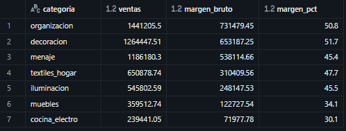
 
_Ventas y margen bruto por categoría_

### Pregunta 4: ¿Cuáles son los 3 productos más vendidos de cada categoría?
 
Sumé las ventas por producto en una CTE y numeré los productos dentro de cada categoría con `ROW_NUMBER()`, de mayor a menor venta. Agrupé por `product_id` y no por nombre, porque hay nombres repetidos: "Repisa Nazca" aparece en el top de menaje y de muebles, y son dos productos distintos.
 
Hay productos que sostienen solos su categoría: **"Organizador Cusco" vende 412,6 mil soles, casi el triple que el segundo de decoración** (145,3 mil). Son productos que no pueden quedarse sin stock.
 
```sql
WITH ventas_producto AS (
    SELECT
        p.category                          AS categoria,
        p.product_id,
        p.product_name,
        SUM(oi.quantity * oi.unit_price)    AS ventas
    FROM order_items oi
    JOIN products p     ON p.product_id = oi.product_id
    JOIN orders_clean o ON o.order_id   = oi.order_id
    WHERE o.order_status = 'COMPLETED'
      AND o.order_datetime < '2026-02-01'
    GROUP BY p.category, p.product_id, p.product_name
)
SELECT *
FROM (
    SELECT
        categoria, 
        product_id, 
        product_name,
        ROUND(ventas, 2)                                                 AS ventas,
        ROW_NUMBER() OVER (PARTITION BY categoria ORDER BY ventas DESC)  AS puesto
    FROM ventas_producto
) AS ranking
WHERE puesto <= 3
ORDER BY categoria, puesto;
```
 
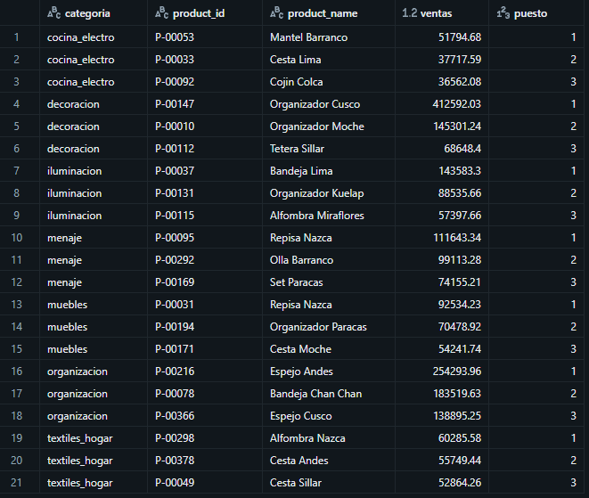
 
_Los 3 productos más vendidos de cada categoría_
 
### Pregunta 5: ¿Cómo se comparan Lima y provincia en ventas, ticket y costo de envío?
 
Uní los pedidos con los clientes para obtener la región, y comparé 2024–2025: ventas, ticket, envío cobrado y costo real del envío.
 
**Provincia es el 44 % de las ventas** y tiene el mismo ticket que Lima (≈ 152 vs 154 soles). Pero su envío está **subsidiado**: cuesta en promedio **26,75 soles** y se cobra **5,82**. En dos años, Tunki absorbió **333 mil soles** de envío en provincia, el doble que en Lima.
 
```sql
SELECT
    c.shipping_region                                               AS region,
    COUNT(o.order_id)                                               AS pedidos,
    ROUND(SUM(o.merchandise_value), 2)                              AS ventas_total,
    ROUND(SUM(o.merchandise_value) / COUNT(o.order_id), 2)          AS ticket_promedio,
    ROUND(AVG(o.shipping_fee_charged), 2)                           AS envio_cobrado_prom,
    ROUND(AVG(o.shipping_cost_actual), 2)                           AS envio_costo_prom,
    ROUND(SUM(o.shipping_cost_actual - o.shipping_fee_charged), 2)  AS subsidio_envio_total
FROM orders_clean o
JOIN customers_clean c ON c.customer_id = o.customer_id
WHERE o.order_status = 'COMPLETED'
  AND o.order_datetime < '2026-01-01'
GROUP BY c.shipping_region
ORDER BY ventas_total DESC;
```
 
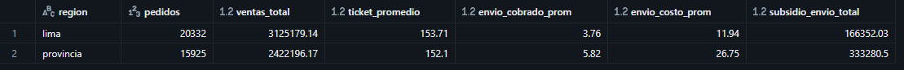
 
_Ventas, ticket y envío por región (2024–2025)_
 
### Pregunta 6: ¿Cómo crecen las ventas frente al mismo mes del año anterior?
 
Comparar enero contra diciembre mezcla la estacionalidad con el desempeño real: enero siempre cae después de las fiestas. Por eso comparé cada mes con **el mismo mes del año anterior**, usando `LAG` con `PARTITION BY MONTH(mes)`, para que enero se compare solo con enero.
 
Durante **12 meses seguidos** las ventas crecieron entre **9 % y 25 %**. En **enero 2026 la tendencia se rompe**: las ventas caen **9,4 % (−14,5 mil soles)** y los pedidos, **13,2 %**. El ticket subió (≈ 4 %), en línea con el aumento de precios de julio 2025. **La caída no es estacional y viene de la cantidad de pedidos.**
 
```sql
WITH ventas_mes AS (
    SELECT
        DATE_TRUNC('MONTH', order_datetime)  AS mes,
        SUM(merchandise_value)               AS ventas
    FROM orders_clean
    WHERE order_status = 'COMPLETED'
      AND order_datetime < '2026-02-01'
    GROUP BY mes
),
comparado AS (
    SELECT
        mes, 
        ventas,
        LAG(ventas)  OVER (PARTITION BY MONTH(mes) ORDER BY mes)  AS ventas_aa
    FROM ventas_mes
)
SELECT
    DATE_FORMAT(mes, 'yyyy-MM')                          AS fecha,
    ROUND(ventas, 2)                                     AS ventas,
    ROUND(ventas_aa, 2)                                  AS ventas_anio_anterior,
    ROUND((ventas / ventas_aa - 1) * 100, 1)             AS crec_ventas_pct
FROM comparado
WHERE ventas_aa IS NOT NULL
ORDER BY mes;
```
 
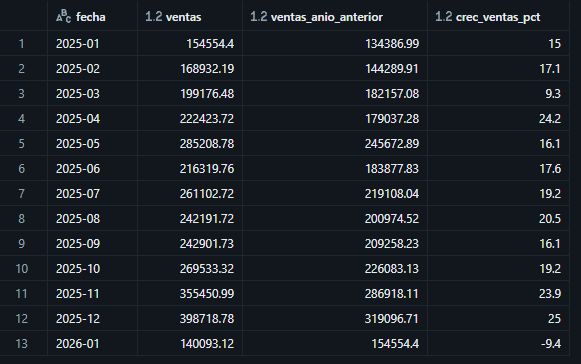
 
_Variación de cada mes frente al mismo mes del año anterior_
 
### Pregunta 7: ¿En qué región y en qué tipo de pedido cayó enero 2026?
 
Comparé los pedidos de enero 2025 y enero 2026 por región y por rango de monto del pedido. Los rangos los armé con `CASE`, y cada año lo conté en su propia columna con `count_if`.
 
**La caída es de provincia:** sus pedidos pasaron de 441 a 194 (−56 %), mientras Lima creció en los tres rangos. Dentro de provincia, el rango que más cayó es el de **S/ 79 a 149: −78 %** (137 → 30), casi el doble que los otros rangos (−46 %).
 
```sql
SELECT
    c.shipping_region                                  AS region,
    CASE
        WHEN o.merchandise_value < 79  THEN '1. Menos de S/ 79'
        WHEN o.merchandise_value < 149 THEN '2. S/ 79 a 149'
        ELSE                                '3. S/ 149 a más'
    END                                                AS rango_monto,
    count_if(YEAR(o.order_datetime) = 2025)            AS pedidos_ene_2025,
    count_if(YEAR(o.order_datetime) = 2026)            AS pedidos_ene_2026
FROM orders_clean o
JOIN customers_clean c ON c.customer_id = o.customer_id
WHERE o.order_status = 'COMPLETED' AND MONTH(o.order_datetime) = 1 AND YEAR(o.order_datetime) IN (2025, 2026)
GROUP BY region, rango_monto
ORDER BY region, rango_monto;
```
 
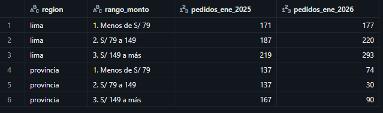
 
_Pedidos de enero por región y rango de monto_
 
### Pregunta 8: ¿Qué cambió en el envío a provincia en enero 2026?
 
La data no trae la política de envío, pero se puede deducir: agrupé los pedidos por región, período y tarifa cobrada, y miré el monto mínimo y máximo de cada grupo. Eso muestra desde qué monto el envío es gratis y cuánto se cobra.
 
| Región | Hasta dic-2025 | Desde ene-2026 |
|---|---|---|
| Lima | Gratis desde S/ 79; si no, S/ 12,90 | Sin cambios |
| Provincia | Gratis desde S/ 79; si no, S/ 19,90 | **Gratis desde S/ 149; si no, S/ 29,90** |
 
El **1 de enero de 2026 cambió el envío solo para provincia**: la tarifa subió 50 % y el umbral de envío gratis casi se duplicó. Los pedidos de **S/ 79 a 149**, que antes tenían envío gratis, pasaron a pagar S/ 29,90. Es justo el rango que más cayó en la pregunta 7.
 
```sql
SELECT
    c.shipping_region                                                            AS region,
    CASE WHEN o.order_datetime < '2026-01-01' THEN '2024-2025' ELSE '2026' END   AS periodo,
    o.shipping_fee_charged                                                       AS envio_cobrado,
    COUNT(*)                                                                     AS pedidos,
    ROUND(MIN(o.merchandise_value), 2)                                           AS monto_min,
    ROUND(MAX(o.merchandise_value), 2)                                           AS monto_max
FROM orders_clean o
JOIN customers_clean c ON c.customer_id = o.customer_id
WHERE o.order_status = 'COMPLETED'
GROUP BY region, periodo, envio_cobrado
ORDER BY region, periodo, envio_cobrado;
```
 
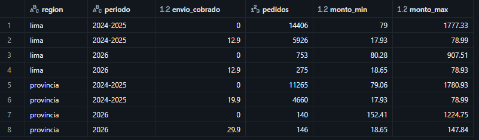
 
_Tarifa de envío cobrada y rango de montos por región y período_
 
## Conclusión
 
**Qué sostiene el negocio**
- **Tres categorías** (organización, decoración y menaje) generan el 68 % de las ventas y el 72 % del margen.
- **Algunos productos sostienen solos su categoría,** como Organizador Cusco, que vende casi el triple que el segundo de decoración.
- **Provincia es el 44 % de las ventas,** con el mismo ticket que Lima, pero su envío está subsidiado: 333 mil soles en dos años.

**Qué pasó en enero 2026**
- **La caída no fue estacional.** Después de 12 meses de crecimiento, enero 2026 cayó 9,4 % frente a enero 2025. Las cancelaciones tampoco subieron.
- **La caída es de provincia,** con −56 % de pedidos, mientras Lima seguía creciendo.
- **Coincide con el cambio de envío a provincia** del 1 de enero de 2026: tarifa de S/ 19,90 a S/ 29,90 y umbral de envío gratis de S/ 79 a S/ 149. El rango que perdió el envío gratis (S/ 79–149) fue el que más cayó (−78 %).

**Recomendación**
1. **Revisar la política de envío a provincia.** El problema que buscaba resolver es real, porque el envío está subsidiado, pero la medida hizo caer los pedidos. Las alternativas a evaluar son un umbral intermedio (por ejemplo, gratis desde S/ 99) o una tarifa menor para el rango S/ 79–149.
2. **Probar el ajuste en algunas ciudades antes de aplicarlo a todo provincia,** y medir los pedidos de provincia contra el mismo mes del año anterior.
3. **Asegurar el stock de los productos que sostienen cada categoría.**

**Limitaciones**
- Los datos son sintéticos; el caso es un ejercicio de práctica.
- **La relación entre el cambio de envío y la caída es una inferencia, no una prueba.** Coinciden la fecha, la región y el rango, pero confirmarlo requiere un experimento.